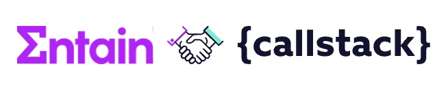
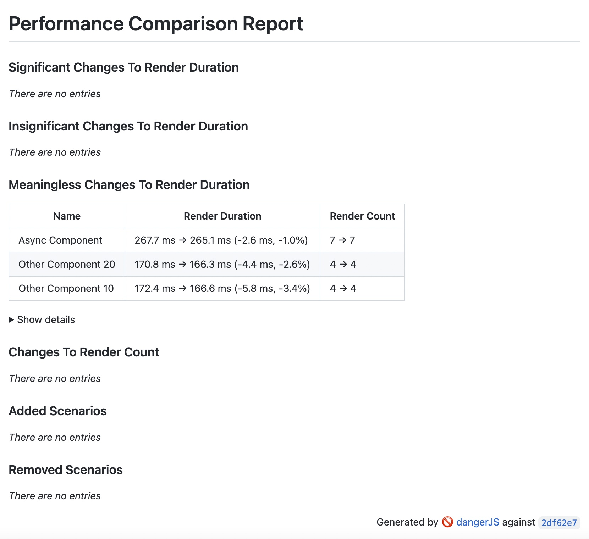
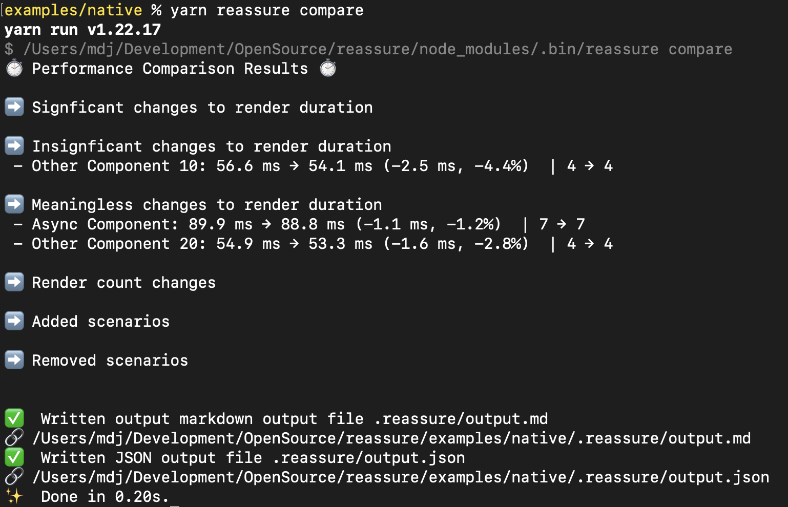

<p align="center">

</p>
<p align="center">
Performance testing companion for React and React Native.
</p>
<p align="center">

</p>

---

- [The problem](#the-problem)
- [The solution](#the-solution)
- [Installation and setup](#installation-and-setup)
  - [NPM package](#npm-package)
  - [Writing First Test](#writing-first-test)
    - [Async tests](#async-tests)
  - [Optional: ES Lint setup](#optional-es-lint-setup)
  - [Measuring test performance](#measuring-test-performance)
  - [Write performance testing script](#write-performance-testing-script)
  - [CI integration](#ci-integration)
- [Assessing CI stability](#assessing-ci-stability)
- [Analysing results](#analysing-results)
- [API](#api)
  - [Measurements](#measurements)
    - [measurePerformance](#measureperformance)
  - [Configuration](#configuration)
    - [`configure`](#configure)
  - [resetToDefault](#resettodefault)
- [Credits](#credits)
- [Contributing](#contributing)
- [License](#license)

## The problem

Optimising performance of React Native app is a complicated task, you have to profile the app, observe render patterns,
apply memoization in the right places, etc. The results are frequently impressive, but also fragile. It's very easy to
introduce performance issues, e.g. by breaking carefuly crafted component memoization with seamingly innoncent code.
Especially in a large project, especially with a large team, especially when shipping new features in a fast pace.

On the other hand requireing developers to manually analyse performance as a part of PR review process is not feasible
solution, as it will bring your time to grind.

## The solution

Reassure allows you to automate React Native profiling on CI, or your local machine. The same way you write your 
integration and unit tests that automatically verify that your app is still *working correctly*, you can write
performance tests that verify that your app still *working performantly*. 

Actually, peformance tests writen using Reassure look very similar to integration tests written using
[React Native Testing Library](https://github.com/callstack/react-native-testing-library). That's because we
build Reassure on top of it, so that you can easily re-use your integration test scenarios as performance tests.

Reassure works by measuring render characteristics (render duration and count) of your modified code ("current", 
e.g your PR branch) and comparing that to render characteristics of the stable version of your code ("baseline",
usually your `main` branch). We do it many time to reduce impact of random variations in render times. Then we apply
statistical analysis to figure out whether the code changes have a statistically-signifcant impact, both positive
and negative on any of your performance test scenarios. Finnaly, we generate a easily-readable report summarising
our findings and displaying it on the CI.

<p align="center">

</p>

## Installation and setup

### NPM package

In order to install Reassure run following command in your app folder:

Using yarn
```
yarn add --dev @reassure/reassure
```

Using npm
```
npm install --save-dev @reassure/reassure
```

You will also need a working [React Native Testing Library](https://github.com/callstack/react-native-testing-library#installation)
and [Jest](https://jestjs.io/docs/getting-started) setup.

### Writing First Test

Next you can write you first test scenario:

```ts
// ComponentUnderTest.perf-test.tsx
import { measurePerformance } from '@reassure/reassure';

test('Simple test', async () => {
  await measurePerformance(<ComponentUnderTest />);
});
```

This test will measure render times of `ComponentUnderTest` during mounting and resulting sync effects.

Your file should have `perf-test.js`/`perf-test.tsx` extensions in order to separate it from regular test files.
Reassure will automatically match test filenames using jest `--testMatch` option with value
 `"<rootDir>/**/*.perf-test.[jt]s?(x)"`.

#### Async tests

If your compoment contains any async logic or you want to test some interaction you should pass `scenario` option:

```ts
import { measurePerformance } from '@reassure/reassure';
import { RenderAPI, fireEvent } from '@testing-library/react-native';

test('Test with scenario', async () => {
  const scenario = async (screen: RenderAPI) => {
    fireEvent.press(screen.getByText('Go'));
    await screen.findByText('Done');
  };

  await measurePerformance(<ComponentUnderTest />, { scenario });
});
```

The body of `scenario` function is using familiar React Native Testing Library methods.

If your test contains any async changes, you will need to make sure that the scenario waits for these changes to settle, e.g. using
`findBy` queries, `waitFor` or `waitForElementToBeRemoved` functions from RNTL.

For more examples look into our [test examples app](https://github.com/callstack-internal/reassure/tree/main/examples/native/src/__tests__).

### Optional: ES Lint setup

ES Lint might require you to have at least one `expect` statement in each of your tests. In order to avoid this requirement
for performance tests you can add following override to your `.eslintrc` file:

```
rules: {
  'jest/expect-expect': [
    'error',
    { assertFunctionNames: ['measurePerformance'] },
  ],
}
```
### Measuring test performance

In order to measure your first test performance you need to run following command in terminal:

```
> yarn reassure measure
```

This command will run your tests multiple times using Jest, gathering render statistics, and will write them to 
`.reassure/current.perf` file. In order to check your setup, check if the output file existis after running the 
command for the first time.

### Write performance testing script

In order to detect performance changes, you need to measure the performance of two versions of your code
current (your modifed code), and baseline (your reference point, e.g. `main` branch). In order to measure performance
on two different branches you need to either switch branches in git or clone two copies of your repository.

We want to automate this task, so it can run on the CI. In order to do that you will need to create a
performance testing script. You should save it in your repository, e.g. as `reassure-tests.sh`.

A simple version of such script, using branch chaning approach is as follows:

```sh
#!/usr/bin/env bash

CURRENT_BRANCH=$(git rev-parse --short HEAD)
BASELINE_BRANCH=${BASELINE_BRANCH:="main"}

# Gather baseline perf measurements
git checkout "$BASELINE_BRANCH";
npx reassure measure --baseline

# Gather current perf measurements
git checkout "$CURRENT_BRANCH";
npx reassure measure

# Compare results
npx reassure compare
```

### CI integration

As a final setup step you need to configure your CI to run the performance testing script and output the result.
For presenting output at the moment we integrate with Danger JS, which supports all major CI tools.

You you will need a working [Danger JS setup](https://danger.systems/js/guides/getting_started.html).

Then add Reassure Danger JS plugin to your dangerfile :
```ts
import path from 'path';
import reassure from './packages/reassure/plugins';

reassure({
  inputFilePath: path.join(__dirname, './examples/native/.reassure/output.md'),
});
```

You can also check our example [Dangerfile](https://github.com/callstack-internal/reassure/blob/main/dangerfile.ts).

Finally run both performance testsing script & danger in your CI config:
```yaml
- name: Run performance testing script
  run: ./reassure-tests.sh

- name: Run danger.js
  uses: danger/danger-js@9.1.6
  env:
    GITHUB_TOKEN: ${{ secrets.GITHUB_TOKEN }}
```

You can also check our example [GitHub workflow](https://github.com/callstack-internal/reassure/blob/main/.github/workflows/main.yml).

## Assessing CI stability

During peformance measurements we measure React component render times in miliseconds, aka wall clock time. This means
that the same code will run faster (less ms) on faster machine and slower (more ms) on slower machine. For this reason,
baseline & current measurements needs to be run on the same machine. Optimally, they should be run one after another.

Moreover, in order to achieve meaningful results your CI agent needs to have stable performance. It does not matter
really if your agent is fast or slow as long as it is consistent in it performance. That's why during the performance
tests the agent should not be used for any other work that might impact measuring render times.

In order to help you assess your machine stability, you can use `reassure check-stability` command. It can be used
both CI and locally.

You can refer to your example [GitHub workflow](https://github.com/callstack-internal/reassure/blob/main/.github/workflows/stability.yml).
## Analysing results

Markdown report
<p align="center">

</p>

Console report
<p align="center">

</p>
Looking at the example you can notice that test scenarios can be assigned to certain categories:

- **Significant Changes To Render Duration** shows test scenario where the change is statistically significant and **should** be looked into as it marks a potential performance loss/improvement
- **Meaningless Changes To Render Duration** shows test scenarios where the change that statistically meaningless, i.e. is random noise
- **Insignificant Changes To Render Duration** shows change that cannot be easily categorized as significant or meaningless.
- **Changes To Render Count** shows test scenarios where render count did change
- **Added Scenarios** shows test scenarios which do not exist in the baseline measurements
- **Removed Scenarios** shows test scenarios which do not exist in the current measurements

## API
### Measurements
#### measurePerformance

Custom wrapper for the RNTL `render` function responsible for rendering the passed screen inside a `React.Profiler` component,
measuring its performance and writing results to output file. You can use optional `options` object allows customizing aspects
of the testing

```ts
export async function measureRender(ui: React.ReactElement, options?: MeasureOptions): Promise<MeasureRenderResult> {
```

**MeasureOptions type**

```ts
export interface MeasureOptions {
  runs?: number;
  dropWorst?: number;
  wrapper?: (node: React.ReactElement) => JSX.Element;
  scenario?: (view: RenderAPI) => Promise<any>;
}
```

- **`runs`**: number of runs per series for the particular test
- **`dropWorst`**: number of worst (highest) runs dropped from a test series
- **`wrapper`**: custom JSX wrapper, such as a `<Provider />` component, which the ui needs to be wrapped with
- **`scenario`**: a custom async function, which defines user interaction within the ui by utilised RNTL functions

### Configuration

The default config which will be used by the measuring script. This configuration object can be overridden with the use
of the `configure` function.

```ts
export const defaultConfig = {
  runs: 10,
  dropWorst: 1,
  outputFile: '.reassure/current.perf',
};
```

**`runs`**: number of repeated runs in a series per test (allows for higher accuracy by aggregating more data). Should be handled with care.
**`dropWorst`**: number of worst dropped results from the series per test (used to remove test run outliers)
dropWorst
**`outputFile`**: name of the file the records will be saved to

#### `configure`

```ts
configure(customConfig: typeof defaultConfig): void
```

You can use `configure` function to override the default config parameters.

### resetToDefault

```ts
resetToDefault(): void
```

Reset current config to the original `defaultConfig` object

## Credits

<p align="center">

</p>

Reassure is an Open Source project and will always remain free to use. The project has been developed in close
partnership with [Entain](https://entaingroup.com/) and was originally their in-house project but, thanks to their
willingness to develop the React & React Native ecosystem, we decided to make it Open Source.

If you think it's cool, please star it 🌟

Callstack is a group of React and React Native experts. If you need any help with these or just want to say hi, contact us at hello@callstack.com!

Like the project? ⚛️ [Join the Callstack team](https://callstack.com/careers/?utm_campaign=Senior_RN&utm_source=github&utm_medium=readme) who does amazing stuff for clients and drives React Native Open Source! 🔥


## Contributing

See the [contributing guide](CONTRIBUTING.md) to learn how to contribute to the repository and the development workflow.

## License

MIT
